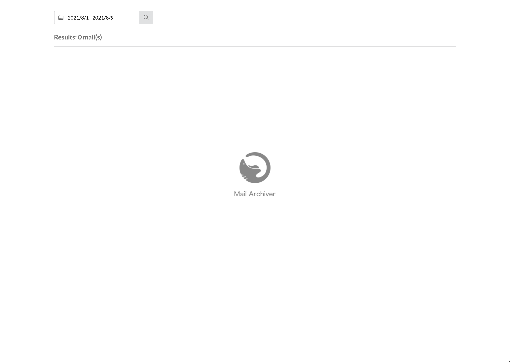
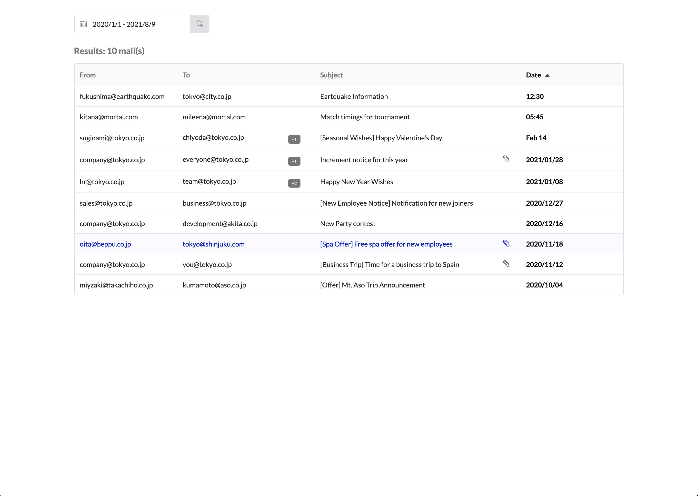
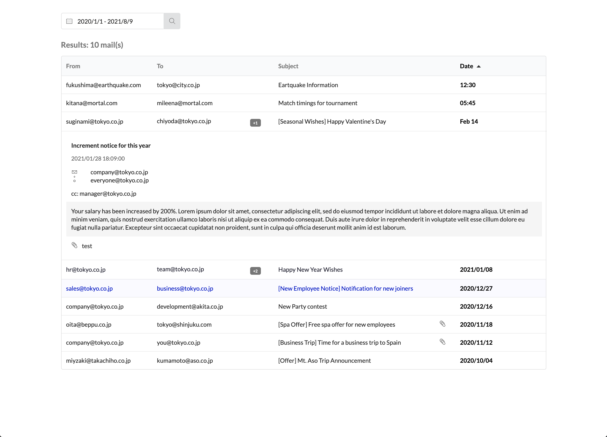
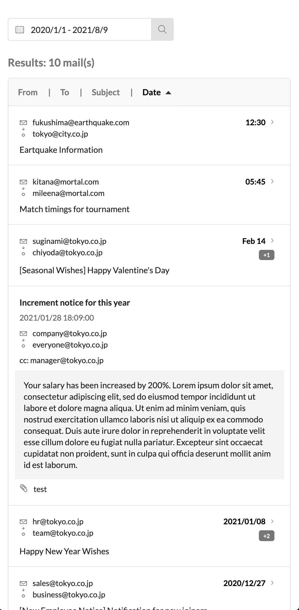

# Report

You can find the online mockup here https://elegant-archimedes-989cda.netlify.app/

## Framework and Library
I used ReactJS to make this app. There are mainly 3 components

- EmailItem (For individual email item)
- EmailList (For email list)
- SearchBar (For searching dates)

The app is responsive and adjusts the layout according to the device screen size. I have also extended the original app to display the email details by clicking the email row. You can click it again to close it. You can inspect multiple emails at once.

## Screens

### Initial Screen

### Search Results

### Email Inspection

### Mobile Results
| Search Results                        | Inspection Results                    |
| ------------------------------------- | ------------------------------------- |
|  |  |

## Challenges

Some of the challenges that I faced were responsiveness of the app and making it scalable. 
I think UI can also process large dataset if given as a list. Another challenge that I faced was rendering result after searching but thanks to ReactJS it was manageable.